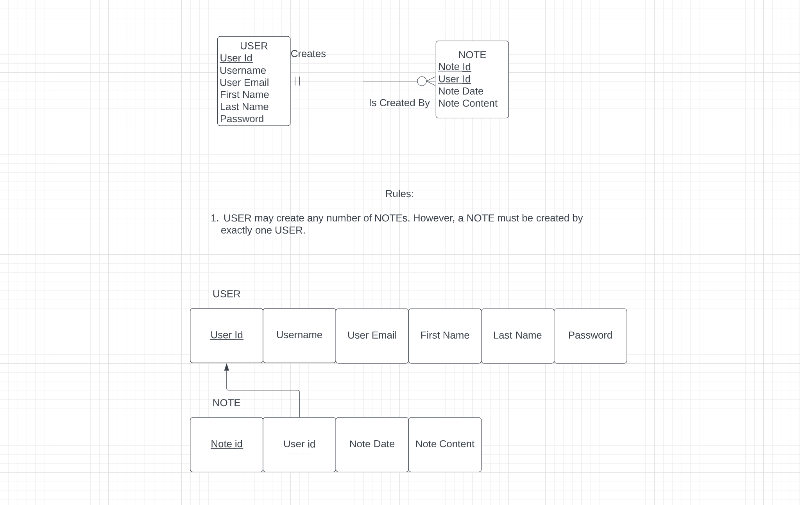

# WDP 2022 Project

## Note Taking App - Fall 2022

### Uses:

- HTML
- CSS
- Javascript
- Node JS
- Express
- Mysql

### Description:

- This web app allows a user to create an account, log in and out, and add notes.
- All users and notes are saved in a mysql database

### Project's ERD:

